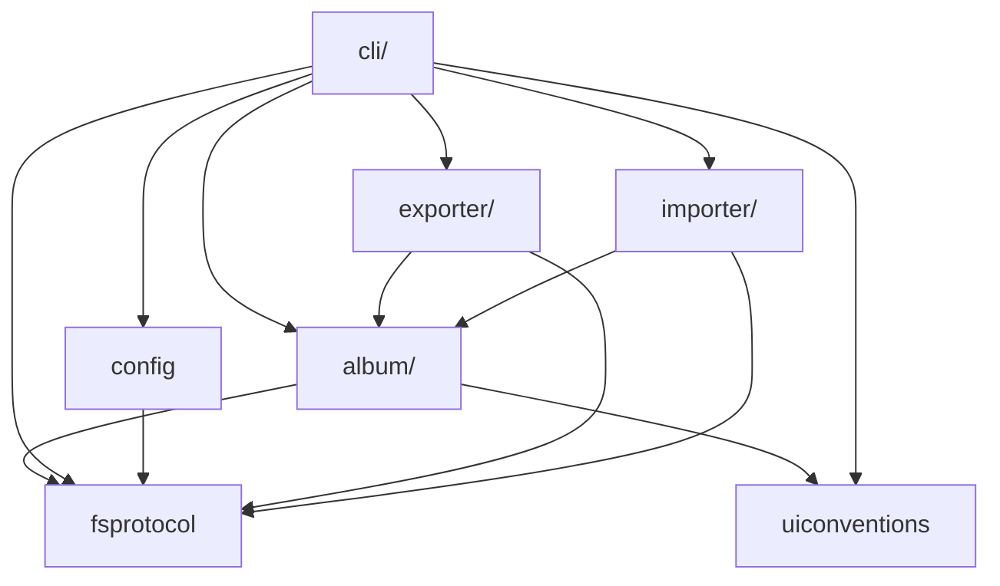

# Architecture

[README.md](../README.md) documents the main use cases and philosophy that guide the design of photree.

For the Image Capture file structure and iOS album on-disk layout, see [internals.md](./internals.md).

## Package Layout

photree follows a flat package layout with the following top-level modules:

- `cli/` — Typer-based CLI entry point and command definitions

<!-- BEGIN MODULE OVERVIEW (auto-generated by: mise run depgraph — do not edit manually) -->
## Module Overview

Dependencies between top-level modules (auto-generated via `mise run depgraph`):

<!-- END MODULE OVERVIEW -->
