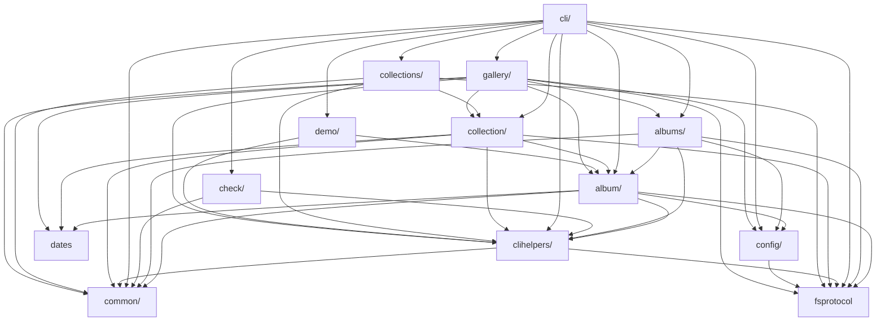

# Architecture

[README.md](../README.md) documents the main use cases and philosophy that guide the design of photree.

For the domain concepts (albums, media sources, collections, naming conventions), see
[domain.md](./domain.md). For the on-disk layout and metadata formats, see
[internals.md](./internals.md).

## Package Layout

photree follows a flat package layout with the following top-level modules:

- `cli/` — Typer-based CLI entry point and command definitions
- `dates` — the date grammar shared by album and collection names (date
  specs, inclusive ranges, containment/overlap, timestamp matching). A pure
  foundation module: album naming, EXIF date matching, collection checks and
  smart-collection refresh all build on it instead of on each other.

Within `album/`, media knowledge is split by concern: `album/formats.py`
(recognized extensions and JPEG/priority rules), `album/store/media_source.py`
(the `MediaSource` model and its key functions), `album/store/protocol.py`
(the `.photree/` layout and `AlbumMetadata`), `album/staging.py`
(`to-import-*` staging entry names), `album/naming.py` (album name grammar
and the light check) and `album/exif_date_check.py` (EXIF date matching, part
of the full check).

<!-- BEGIN MODULE OVERVIEW (auto-generated by: mise run depgraph — do not edit manually) -->
## Module Overview

Dependencies between top-level modules (auto-generated via `mise run depgraph`):

```mermaid
graph TD
    album["album/"]
    albums["albums/"]
    check["check/"]
    cli["cli/"]
    clihelpers["clihelpers/"]
    collection["collection/"]
    collections["collections/"]
    common["common/"]
    config["config/"]
    dates["dates"]
    demo["demo/"]
    fsprotocol["fsprotocol"]
    gallery["gallery/"]

    album --> clihelpers
    album --> common
    album --> config
    album --> dates
    album --> fsprotocol
    albums --> album
    albums --> clihelpers
    albums --> common
    albums --> config
    albums --> fsprotocol
    check --> clihelpers
    check --> common
    cli --> album
    cli --> albums
    cli --> check
    cli --> clihelpers
    cli --> collection
    cli --> collections
    cli --> common
    cli --> config
    cli --> demo
    cli --> fsprotocol
    cli --> gallery
    clihelpers --> common
    clihelpers --> fsprotocol
    collection --> album
    collection --> clihelpers
    collection --> common
    collection --> dates
    collection --> fsprotocol
    collections --> clihelpers
    collections --> collection
    collections --> common
    collections --> fsprotocol
    config --> fsprotocol
    demo --> album
    demo --> clihelpers
    gallery --> album
    gallery --> albums
    gallery --> clihelpers
    gallery --> collection
    gallery --> common
    gallery --> config
    gallery --> dates
    gallery --> fsprotocol
```
<!-- END MODULE OVERVIEW -->
